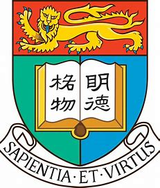
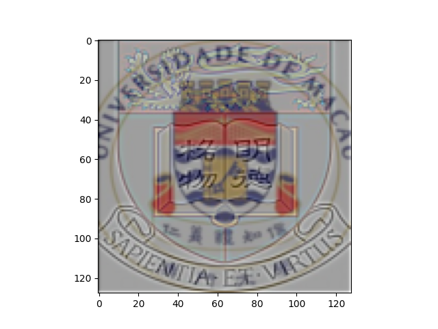

# Hybrid Image Generation Using Gaussian and Laplacian Pyramids

This project demonstrates the creation of hybrid images using Gaussian and Laplacian pyramids. The hybrid image is created by blending the low-frequency portion of one image with the high-frequency portion of another, producing an image that changes its interpretation based on the viewing distance.

## Features
- **Gaussian Pyramid**: Smooths an image and downscales it iteratively to create a multi-resolution representation.
- **Laplacian Pyramid**: Captures the details between different levels of the Gaussian pyramid, serving as a high-frequency representation.
- **Hybrid Image Creation**: Combines Gaussian and Laplacian pyramid components with custom weights to generate the final hybrid image.
- **Image Alignment**: Optional feature for improving alignment between the input images.

## Prerequisites
This project requires the following libraries:
- `matplotlib`
- `numpy`
- `skimage`
- `gridspec`
- `opencv-python`
- `scipy`

You can install the required libraries using pip:
```bash
pip install matplotlib numpy scikit-image opencv-python scipy
```

## File Structure
- `pyramids.py`: Contains functions for generating Gaussian and Laplacian pyramids.
- `align.py`: Optional alignment utilities for images.
- `main.py`: The main script for running the hybrid image generation process.
- `images/`: Directory containing input images.

## Usage

### Input Images
Place the images you want to use in the `images/` folder. For example, this project uses `Umacau.jpg` and `HKU.jpg` as input images.

### Run the Script
To generate Gaussian and Laplacian pyramids and create the hybrid image, run the main script:
```bash
python main.py
```

### Parameters
You can modify the following parameters in the script:
- `kernel`: Gaussian kernel used to smooth images.
- `levels`: Number of levels in the pyramids.
- `alpha`, `beta1`, `beta2`: Weights for blending components of the hybrid image.

### Output
The script will display the following:
1. Gaussian pyramid for each input image.
2. Laplacian pyramid for each input image.
3. Final hybrid image.

The hybrid image can be saved by uncommenting the relevant `plt.savefig` lines in the script.

## Functions
### Gaussian Pyramid
```python
def gaussian_pyramid(image, kernel, levels):
    """
    Creates a Gaussian pyramid.
    :param image: Input image (N, M, 3) or (N, M).
    :param kernel: Gaussian kernel.
    :param levels: Number of levels.
    :return: List of Gaussian pyramid images.
    """
```

### Laplacian Pyramid
```python
def laplacian_pyramid(image, kernel, levels):
    """
    Creates a Laplacian pyramid.
    :param image: Input image (N, M, 3) or (N, M).
    :param kernel: Gaussian kernel.
    :param levels: Number of levels.
    :return: List of Laplacian pyramid images.
    """
```

### Hybrid Image Generation
```python
def main_gaussian_laplacian_pyramids(image, kernel, levels):
    """
    Builds Gaussian and Laplacian pyramids and generates hybrid image.
    :param image: Input image (grayscale or RGB).
    :param kernel: Gaussian kernel.
    :param levels: Number of levels.
    """
```

## Example
### Input
- `images\Umacau.jpg`

- 

**Umacau badge**
- `images\HKU.jpg`

- 

**HKU badge**
### Output
The hybrid image combines the low-frequency content of `Umacau.jpg` with the high-frequency content of `HKU.jpg`. The result changes interpretation when viewed from different distances.
- 

**Hybrid image**
## Notes
- Ensure input images are resized to the same dimensions for better results.
- You can use the `align_images` function for optional image alignment.
- Adjust the weights (`alpha`, `beta1`, `beta2`) to fine-tune the hybridization effect.

## License
This project is released under the MIT License.

